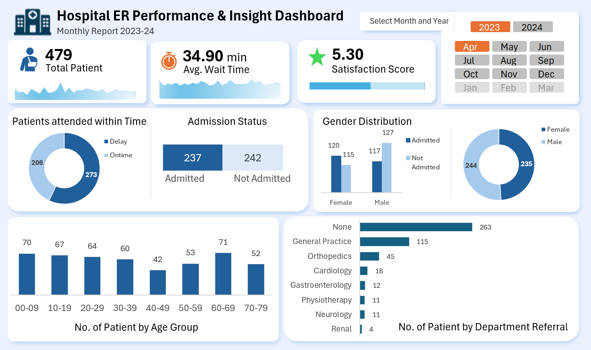

# 🏥 Hospital ER Performance & Insight Dashboard  
### Excel + Power Query Project (2023–24)

## 📌 Overview
An interactive Emergency Room (ER) analytics dashboard built using **Microsoft Excel and Power Query** to analyze hospital performance data for 2023–24.

## 🛠️ Tools Used
- Microsoft Excel  
- Power Query (ETL)  
- Pivot Tables & Pivot Charts  
- Slicers (Month & Year Filters)

## 📊 Key Metrics
- Total Patients  
- Average Wait Time  
- Satisfaction Score  
- Admission Status  
- Gender Distribution  
- Age Group Analysis  
- Department Referrals  

## 🔄 Data Preparation
- Cleaned and transformed raw data using Power Query  
- Removed duplicates and handled missing values  
- Standardized data types and labels  
- Loaded structured data into Excel Data Model  

## 🎯 Purpose
Helps hospital management monitor ER efficiency, patient flow, and department workload through interactive visual insights.

## 📊 Dashboard Preview

---

## 👨‍💻 Author

**Ravsaheb Bansode**  
Aspiring Data Analyst | Excel & Power Query Enthusiast  
